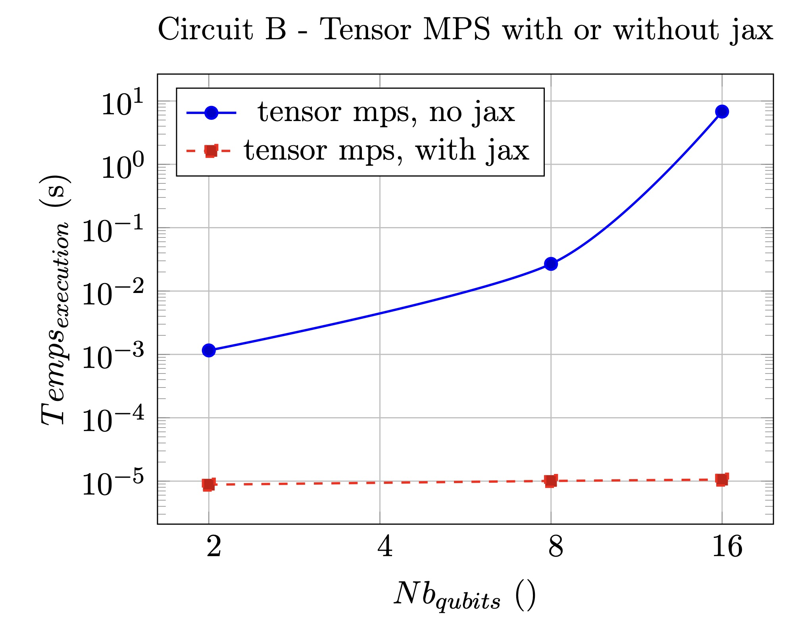
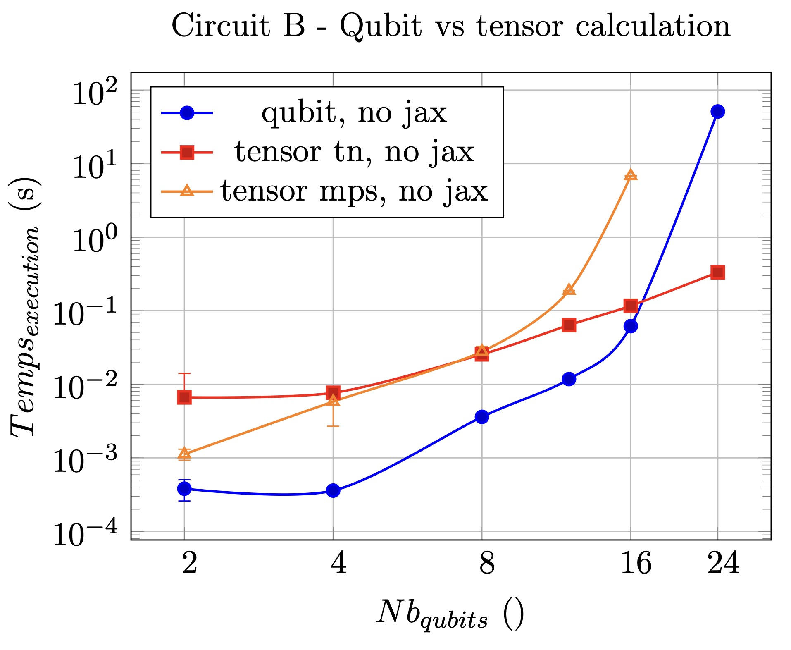
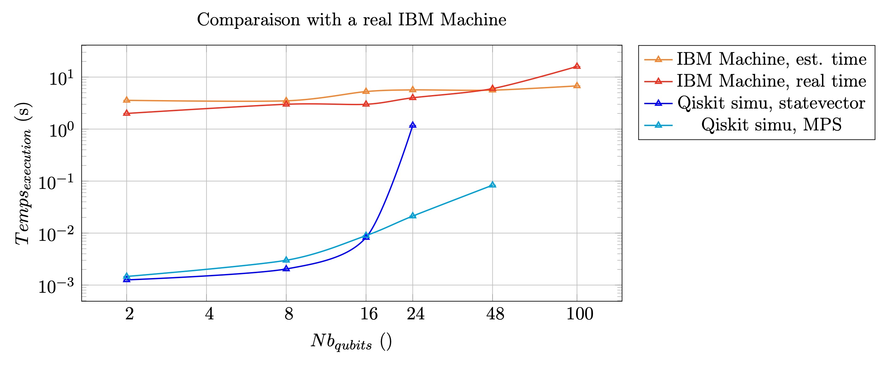

# st7-quantum-simulation

This github containes some code used in the ST7 quantum computing project.
Especially, these are codes used to run the benchmarks presented in the report.
This project was carried out in Februar and March 2025, and presented on 28/03/2025.

## Reminder

The goal of this project was to look into the use of tensor network to enable the simulation of quantum circuits with a high number of qubit by taking advantage of parallel contraction to speed up calculations. In particular, we were interested in the applications to clustering QML problems.
To do this, after discarding other modules like Jet and QXTools (complexity of use or the type of language, julia for QXTools) we decided to look into the combined use of Pennylane and Jax. 
Pennylane, through the 'default.tensor' method (/!\ Still experimental) enables the user to build quantum circuit with tensorial representation. Jax, in particular jax.jit, enables to parallelize the contraction through the compilation on XLA kernels.
The code in the github cover the most important benchmarks run to quantify the gain made through the use of these modules.

# Some results

Use of jax & Computation with qubits vs computation with tensors:

 

Real computation vs simulation:  

For more details, see the report.

# Report

All the work done is detailed in the report, present in the folder ./docs.
The figures of the benchmarks are located in the folder ./results.

# Description of specific files
The codes used for the report are the following:

The file `benchmark-pennylane.py` compares the performances of quantum circuit depending on the method used (default.tensor or default.qubit) and the module used (jax.jit or native methods of pennylane).

The file `benchmark-real.py` contains the code used to run the circuits on real machines (IBM).

The file `benchmark_jax_1or2Dparam.py` contains the code used to calculate the simmilarity matrix in QML problems. It compares performances between one or two dynamic parameters. It shows that a real advantage is obtained for the method with only one dynamic parameter when the number of datapoints is important.

The file `benchmark_pmap.py` contains the code used to benchmark the efficiency of using pmap in addition to the previous method to further increase performances.
Note that this code differs slightly from that present in the report. Final attempts were made to increase performances, but none were conclusive. We kept the simple version in the report for the sake of clarity.

The file `benchmark_nqubits_nfeatures.py` compares Qiskit and PennyLane frameworks in quantum clustering performance (execution time) and quality (NMI score) by varying the number of qubits and for different numbers of features.

# Authors

- Gabriel Rochette
- Alexandre Gravereaux
- Seif Zaafouri