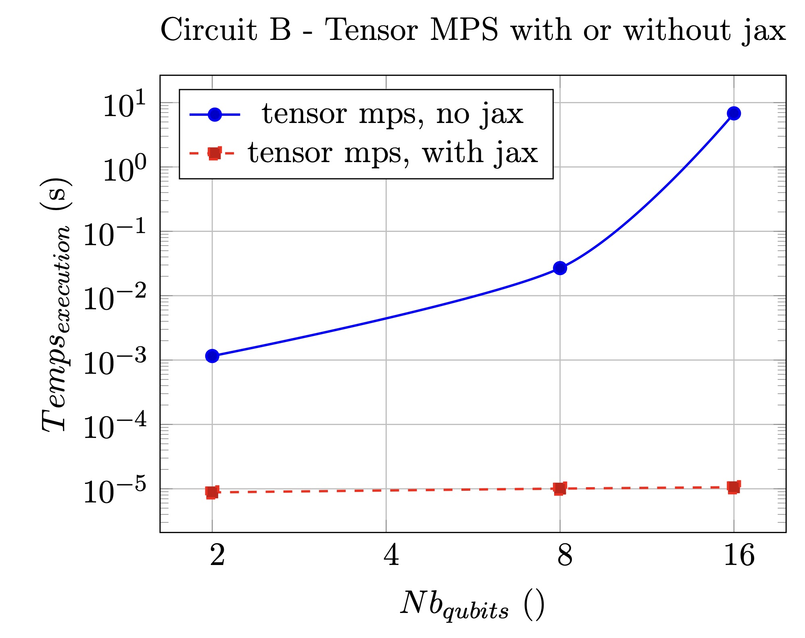
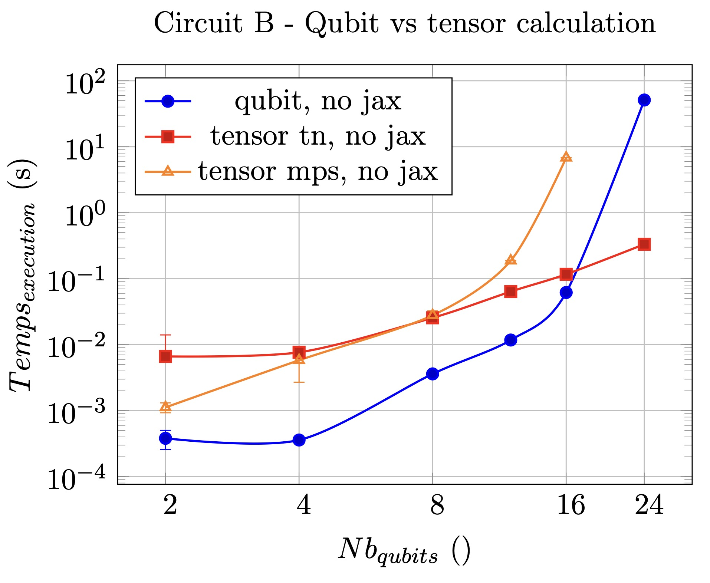
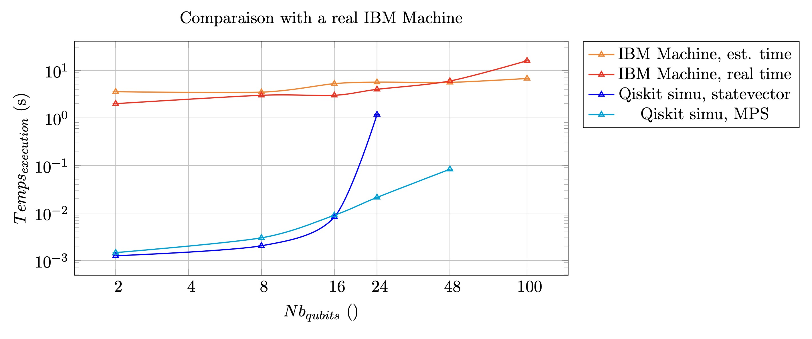

# Quantum Machine Learning & Tensor-Network Simulation

Research project on accelerating **quantum-circuit simulation with tensor networks** and applying these methods to **quantum machine learning for clustering**.

The project benchmarks tensor-network simulation against standard state-vector approaches and studies how JAX/XLA parallelisation can improve execution performance.

## Main goals

- Benchmark **tensor-network** vs **state-vector** quantum simulation
- Accelerate tensor contractions using **JAX / XLA**
- Study parallel execution with **JAX `pmap`**
- Run circuits on **real IBM quantum hardware**
- Use **quantum-state fidelity as a kernel** for clustering
- Compare execution time and clustering quality as the number of qubits and features changes

## Key technologies

- **PennyLane**
- **JAX**
- **Tensor Networks**
- **Qiskit / IBM Quantum**
- Quantum kernels
- Spectral clustering

## Selected results

The experiments compare simulation strategies across increasing circuit sizes and evaluate their impact on quantum-machine-learning workloads.

The QML pipeline achieved **NMI scores up to 0.95** on breast-cancer clustering experiments.

### Tensor-network vs state-vector simulation

<p align="center">
  
  
</p>

### Real quantum hardware vs simulation

<p align="center">
  
</p>

## Repository structure

```text
.
├── benchmark-pennylane.py
├── benchmark-real.py
├── benchmark_jax_1or2Dparam.py
├── benchmark_nqubits_nfeatures.py
├── benchmark_pmap.py
├── requirements.txt
├── results/                     # Benchmark figures
└── docs/                        # Full project report
```

## Benchmark scripts

- **`benchmark-pennylane.py`** — compares `default.tensor` and `default.qubit`, with and without JAX compilation.
- **`benchmark-real.py`** — runs circuits on real IBM quantum machines.
- **`benchmark_jax_1or2Dparam.py`** — benchmarks similarity-matrix computation for QML workloads.
- **`benchmark_pmap.py`** — evaluates additional parallelisation with JAX `pmap`.
- **`benchmark_nqubits_nfeatures.py`** — compares Qiskit and PennyLane across qubit and feature counts.

## Context

Academic research project carried out at **CentraleSupélec / Université Paris-Saclay** in early 2025.

### Authors

- Gabriel Rochette
- Alexandre Gravereaux
- Seif Zaafouri
